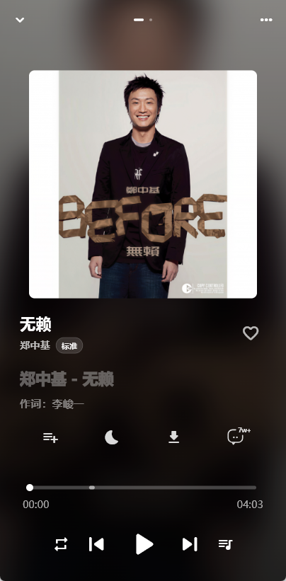
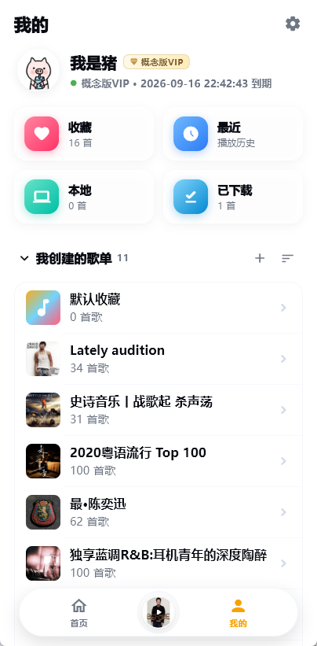
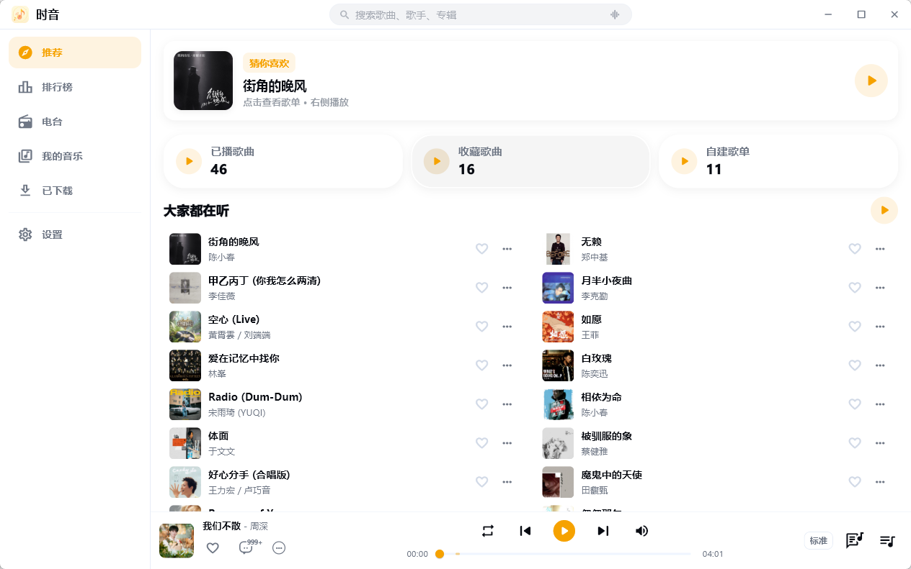
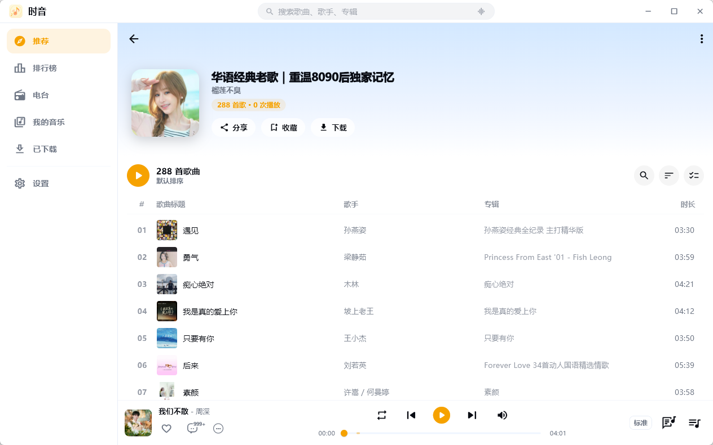
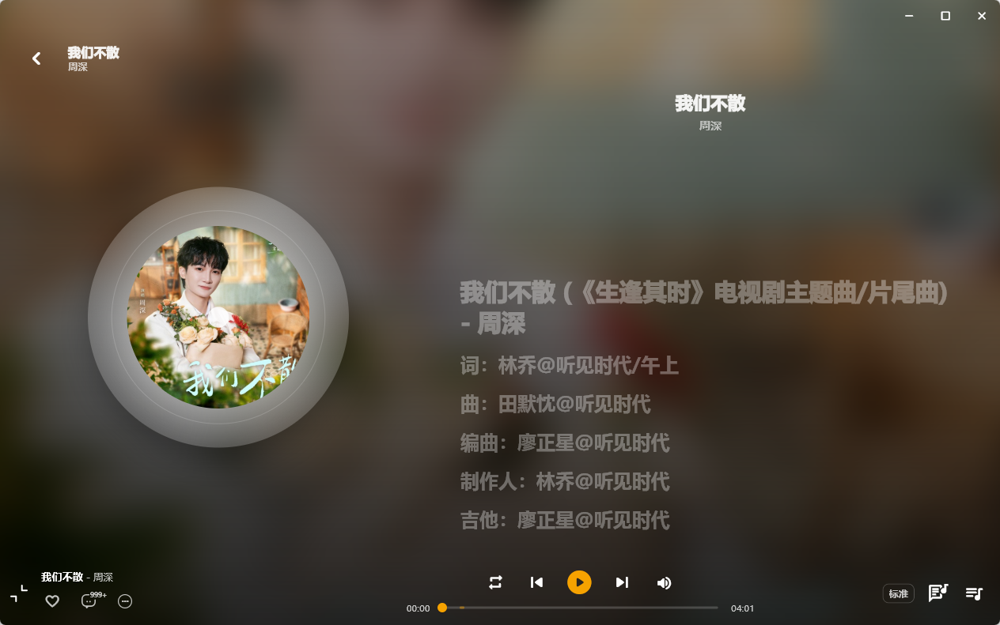
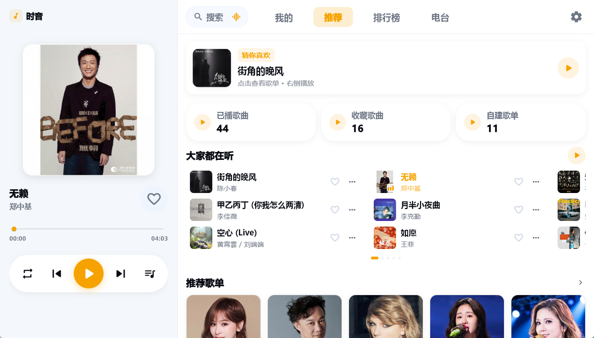
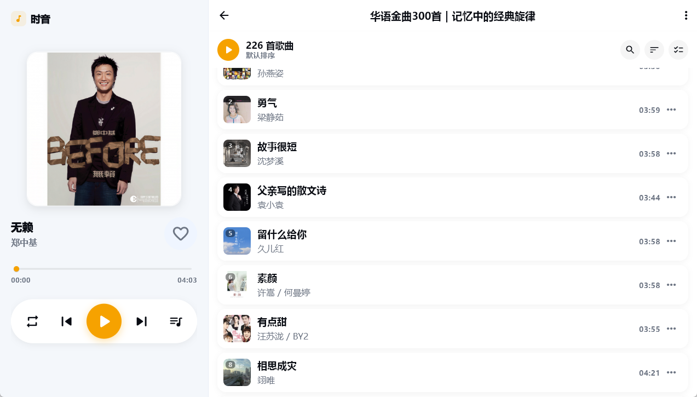
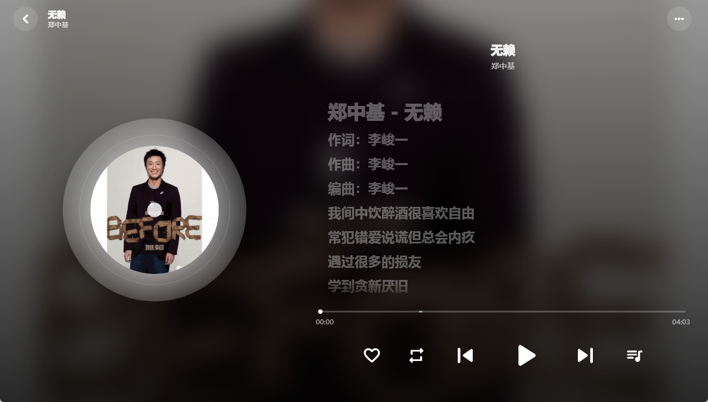

<p align="center">
  
</p>

<h1 align="center">时音 <sub>ShiYin</sub></h1>

<p align="center">
  <strong>一个无需后端、多端适配的第三方音乐客户端</strong>
  <br />
  Flutter 界面 + 本地 Rust 引擎 · 支持多平台 · Material You 设计 · 低内存占用
</p>

<p align="center">
  
  
  
  
</p>

<p align="center">
  
  
  
  
</p>

---

## 📖 简介

时音是一个功能丰富的**第三方音乐播放器**，使用 Flutter 构建。它在 [umr-xiaomai/kgka_Music_hl](https://github.com/umr-xiaomai/kgka_Music_hl) 的基础上做了三件关键的事：

1. **去掉后端依赖** — 把原本依赖远程服务器的酷狗接口逻辑，用 Rust 重写并内嵌到客户端（经 `flutter_rust_bridge` 以 FFI 调用），签名 / 加密 / 会话管理全部在本地完成，**不需要任何第三方服务器**。
2. **深度多端 / 车机适配** — 针对车载、平板等场景做了布局与性能优化。
3. **PC 桌面级体验** — Windows / Linux 原生桌面应用：侧栏 + 底部播放栏的桌面布局、逐字卡拉OK桌面歌词、托盘常驻、系统媒体控制、快捷键与应用内更新。

- **本地 Rust 引擎** — 无后端、零部署，接口逻辑随 App 一起分发
- **听歌识曲** — 听一段旋律即可识别歌曲，桌面支持「麦克风 / 系统内录」双采集源，手机走麦克风
- **PC 桌面端** — 沉浸式标题栏、表格化曲库、桌面歌词悬浮窗、托盘与开机自启
- **内存优化** — 图片缓存限制、细粒度 Widget 重建、GPU 纹理解码分辨率控制
- **车机布局** — 横屏左侧播放面板 + 右侧内容区，适配车载屏幕
- **平板布局** — 宽屏自动切换触屏侧栏 + 内容网格化，导航与迷你播放器常驻侧栏
- **自适应多端** — 同时兼容手机、平板、电视、桌面，自动切换布局

> 🔌 该项目通过第三方接口获取音乐数据，仅供学习交流使用。

---

## 📸 预览

### 📱 移动端

| 推荐页 | 播放页 |
|:----:|:----:|
|  |  |

| 歌单 | 我的 |
|:----:|:----:|
|  |  |

### 🖥️ PC / 桌面

**推荐页**



| 歌单详情 | 播放页 |
|:--------:|:------:|
|  |  |

### 🚗 车机横屏

**推荐页**



| 歌单 | 播放 |
|:----:|:----:|
|  |  |

> 截图以实际运行版本为准，界面与品牌字样可能随版本略有差异。

---

## ✨ 核心功能

### 🎵 音乐播放

- **多音质切换** — 标准 (128K) / 高品质 (320K) / 无损 (FLAC) 三种音质
- **智能降级** — 播放失败时自动降级到更低音质重试，保证播放连续性
- **后台播放** — 支持 Android 通知栏控制及锁屏播放
- **播放模式** — 列表循环 / 随机播放 / 单曲循环
- **倍速播放** — 支持 0.5x ~ 3.0x 变速播放
- **音频均衡器** — 7 种预设音效（流行、摇滚、人声、低音、古典、电子、平板）
- **低音增强** — 0~100% 强度可调
- **定时停止** — 支持按时间或当前歌曲播放完毕后自动停止

### 🎤 歌词

- **逐字歌词** — 支持 KRC 格式的逐字高亮歌词
- **歌词翻译** — 支持翻译和罗马音显示
- **桌面歌词** — 桌面端悬浮歌词窗口（见下方「桌面端」）
- **歌词交互** — 双击跳转进度 / 长按复制 / 字体大小可调

### 🖥️ 桌面端（Windows / Linux）

- **桌面布局** — 沉浸式自定义标题栏 + 侧边栏 + 底部播放栏；歌单 / 排行榜 / 歌手 / 搜索 / 已下载页表格化视图
- **桌面歌词** — 逐字卡拉OK高亮、单 / 双行错行模式、快捷设置菜单、QQ 音乐式锁定全穿透
- **系统集成** — 系统媒体控制（SMTC / MPRIS）、托盘常驻、关闭行为设置、开机自启、窗口标题随歌曲、下载完成通知
- **窗口管理** — 尺寸 / 位置记忆、多显示器 DPI 适配
- **快捷键** — 空格播放暂停、方向键切歌 / 快进快退、侧栏键盘导航
- **应用内更新** — Windows 安装版支持应用内下载更新（sha256 完整性校验），另有便携版解压即用
- **音频后端** — Windows / Linux 使用 libmpv（media_kit）音频后端，桌面播放更稳

### 🔍 搜索与发现

- **听歌识曲** — 听一段旋律即可识别歌曲并直接播放；桌面支持「麦克风 / 系统内录」双采集源，手机与车机走麦克风
- **多平台搜索** — 支持酷狗 + 网易云音乐双源搜索
- **搜索建议** — 实时搜索联想
- **热搜关键词** — 分类展示热门搜索
- **搜索历史** — 本地保存，支持标签式快捷搜索
- **每日推荐** — 个性化歌曲推荐
- **推荐歌单** — 热门歌单浏览
- **FM 电台** — 推荐电台 + 分类电台

### 📚 音乐库管理

- **歌单管理** — 创建 / 收藏 / 重命名 / 排序 / 批量删除
- **歌单分享** — 一键复制歌单歌曲列表到剪贴板
- **歌单导入** — 通过 ID 导入他人歌单
- **歌单内搜索** — 快速查找歌单中的歌曲
- **收藏歌曲** — 我喜欢 / 收藏管理
- **云盘** — 个人云盘音乐存储

### 📥 下载与缓存

- **下载管理** — 支持并发下载、断点续传、进度追踪
- **播放缓存** — 自动缓存播放过的歌曲，LRU 策略上限 300MB
- **数据缓存** — SWR（Stale-While-Revalidate）策略，分级 TTL
- **缓存可视化** — 数据缓存 / 下载 / 播放缓存大小查看与清理

### 🎨 个性化

- **Material You** — 支持 Dynamic Color，8 种预设种子色
- **深色模式** — 跟随系统或手动切换
- **自定义背景** — 支持从相册选取图片作为全局背景，可调透明度

### 📊 数据统计

- **播放历史** — 最近播放歌曲记录（最近 500 首）
- **播放统计** — 累计播放次数、听歌时长
- **Top 榜单** — 最常听歌手 / 歌曲 Top 10

---

## 🏗️ 技术栈

| 类别 | 技术 |
|---|---|
| **框架** | Flutter (SDK ^3.11.5) |
| **界面语言** | Dart |
| **接口引擎** | **Rust**（`kugou_engine` crate，经 `flutter_rust_bridge` 2.12.0 以 FFI 暴露给 Dart） |
| **音频播放** | `just_audio` — 低延迟音频引擎；Windows / Linux 桌面后端为 `media_kit`（libmpv） |
| **后台播放** | `audio_service` — 通知栏控制 & 后台保活（桌面为 SMTC / MPRIS 系统媒体集成） |
| **多窗口** | `desktop_multi_window` — 桌面歌词悬浮窗 |
| **音频焦点** | `audio_session` — 系统级音频焦点管理 |
| **文件下载** | `dio` |
| **持久化** | `shared_preferences` — 设置 & 缓存 |
| **状态管理** | `ChangeNotifier` + `AnimatedBuilder`（原生方案） |
| **路由** | Navigator 1.0 |
| **设计系统** | Material 3 (Material You) |
| **代码规范** | `flutter_lints` |

---

## 📐 架构设计

分层如下，酷狗接口的请求 / 签名 / 加密 / 会话全部在 Rust 引擎内完成：

```
┌──────────────────────────────────────┐
│              UI Layer                │
│   Pages · Widgets · AppTheme         │
├──────────────────────────────────────┤
│           Controllers                │
│   Auth · Player · Download · Theme   │  ← ChangeNotifier
├──────────────────────────────────────┤
│            Services                  │
│   MusicApi · CacheService            │
│   DownloadService · AudioHandler     │
├──────────────────────────────────────┤
│         Dart FFI 绑定层               │
│   lib/src/rust (frb 生成) · RustLib   │
├──────────────────────────────────────┤
│           Rust 引擎 (rust/)           │
│   酷狗接口 · 签名/加密 · 会话管理      │  ← kugou_engine crate
├──────────────────────────────────────┤
│             Config                   │
│   AppConfig · Models                 │
└──────────────────────────────────────┘
```

- **无后端** — 接口逻辑随客户端分发，不依赖任何远程服务器
- **分层清晰** — UI → Controller → Service → FFI → Rust，单向依赖
- **手动 DI** — 构造函数注入，无第三方 DI 框架
- **SWR 缓存** — 先返回缓存数据，后台刷新，失败回退缓存
- **会话管理** — 登录态在 Rust 引擎内持久化与自动恢复

---

## 🚀 快速开始

### 环境要求

- Flutter SDK >= 3.11.5 / Dart SDK >= 3.11.5
- **Rust 工具链**（`rustup` / `rustc` / `cargo`）— 安装见 [rustup.rs](https://rustup.rs)
- **flutter_rust_bridge 代码生成器**（仅在修改 Rust 接口时需要）：`cargo install flutter_rust_bridge_codegen --version 2.12.0`
- Android 构建额外需要：[`cargo-ndk`](https://github.com/bbqsrc/cargo-ndk) （`cargo install cargo-ndk`）+ 对应 Rust 目标（如 `rustup target add aarch64-linux-android`）+ Android NDK
- 目标平台对应的 SDK（Android Studio / Xcode / VS Code 等）

> 各平台 Rust 交叉编译目标的完整配置，请参考 [flutter_rust_bridge 官方文档](https://cjycode.com/flutter_rust_bridge/guides/miscellaneous/setup)。

### 安装与运行

```bash
# 克隆仓库
git clone https://github.com/bamboostrip/shiyin-music.git
cd shiyin-music

# 安装依赖
flutter pub get

# 运行（Rust 引擎会在构建时自动编译；选择目标平台）
flutter run          # 自动检测设备
flutter run -d android
flutter run -d windows
flutter run -d linux
```

> 仓库已提交 `lib/src/rust/` 下的 FRB 生成代码，普通构建**无需**手动跑代码生成。
> **只有当你修改了 `rust/` 下的 Rust 接口**时，才需要重新生成绑定：
>
> ```bash
> flutter_rust_bridge_codegen generate
> ```

### 编译环境变量

无需配置任何 API 地址 —— 接口由 Rust 引擎直接处理。

| 变量 | 说明 |
|---|---|
| `SHIYIN_DEBUG_LYRICS` | 启用歌词调试日志（旧名 `KA_MUSIC_DEBUG_LYRICS` 仍向后兼容） |

---

## 📁 项目结构

```
.
├── rust/                     # Rust 引擎（kugou_engine crate）
│   ├── Cargo.toml
│   └── src/
│       ├── api.rs            # 经 FRB 暴露给 Dart 的入口
│       ├── engine.rs         # 引擎实现
│       ├── kugou/            # 酷狗协议：签名 / 加密 / 会话 / 传输
│       └── services/         # 各业务接口（搜索 / 歌单 / 歌词 / 排行 …）
├── flutter_rust_bridge.yaml  # FRB 代码生成配置
└── lib/
    ├── main.dart             # 应用入口（含 ImageCache 内存优化配置）
    ├── assets/
    │   └── logo.png          # App Logo
    ├── src/rust/             # FRB 生成的 Dart 绑定（已提交，勿手改）
    ├── config/
    │   └── app_config.dart   # 全局配置（缓存大小等；无后端，故无 API 地址）
    ├── core/
    │   ├── rust_api_client.dart     # 调用 Rust 引擎的 Dart 客户端
    │   └── api_client_interface.dart# 接口抽象
    ├── controllers/
    │   ├── auth_controller.dart     # 登录认证
    │   ├── player_controller.dart   # 播放引擎
    │   ├── download_controller.dart # 下载管理
    │   ├── local_music_controller.dart # 本地音乐（含 LRU 封面缓存）
    │   └── theme_controller.dart    # 主题管理（含车机模式开关）
    ├── models/
    │   ├── music_models.dart        # 音乐领域模型
    │   └── app_version.dart         # 版本更新模型
    ├── services/
    │   ├── music_api.dart           # 接口封装（底层走 Rust 引擎）
    │   ├── cache_service.dart       # 数据缓存（SWR）
    │   ├── download_service.dart    # 文件下载服务
    │   ├── music_audio_handler.dart # 后台音频服务
    │   └── ...                      # 其他服务
    └── ui/
        ├── app_theme.dart           # 主题定义
        ├── adaptive_layout.dart     # 响应式布局（含车机模式判断）
        ├── pages/                   # 页面
        │   ├── app_shell.dart       # 主壳（含车机横屏布局）
        │   ├── home_page.dart       # 首页
        │   ├── player_page.dart     # 播放器
        │   ├── library_page.dart    # 我的
        │   ├── search_page.dart     # 搜索
        │   └── ...                  # 其他页面
        └── widgets/                 # 可复用组件
            ├── mini_player.dart     # 迷你播放栏（细粒度重建优化）
            ├── car_left_player_panel.dart # 车机左侧播放面板
            ├── artwork.dart         # 封面组件（含 GPU 纹理优化）
            └── ...                  # 其他组件
```

---

## 🚗 车载优化

本仓库在原始项目基础上进行了以下车载专项优化：

| 优化项 | 说明 |
|---|---|
| ImageCache 限制 | 50 张 / 10MB（原 1000 张 / 100MB） |
| GPU 纹理控制 | 所有图片解码分辨率按显示尺寸 2x 约束，上限 600px |
| Widget 细粒度重建 | MiniPlayer / CarLeftPlayerPanel 仅更新进度条和播放按钮 |
| 启动延迟 | 非关键初始化挪到首帧渲染之后 |
| 动画复用 | Shimmer 加载动画从 N 个 AnimationController → 1 个 Timer |
| 封面 LRU 淘汰 | 本地专辑封面缓存上限 50 张 |

---

## 🙏 致谢与上游关系

本项目早期基于 [umr-xiaomai/kgka_Music_hl](https://github.com/umr-xiaomai/kgka_Music_hl) 二次开发，感谢原作者的卓越工作。

经过「无后端 Rust 引擎 + 多端 / 车机 / 平板适配」等大规模重构，本仓库架构已与上游显著分化，不再从上游同步，只演进无后端主线。

---

## 📄 许可证

本项目仅供学习交流使用，请勿用于商业用途。

---

<p align="center">
  <sub>Based on umr-xiaomai/kgka_Music_hl · Maintained by bamboostrip</sub>
</p>
